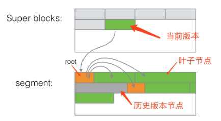

# 标题：BTrDB: Optimizing Storage System Design for Timeseries Processing

## 🍅摘要：

The increase in high-precision, high-sample-rate telemetry timeseries poses a problem for existing timeseries databases which can neither cope with the throughput demands of these streams nor provide the necessary primitives for effective analysis of them. We present a novel abstraction for telemetry timeseries data and a data structure for providing this abstraction: a timepartitioning version-annotated copy-on-write tree. An implementation in Go is shown to outperform existing solutions, demonstrating a throughput of 53 million inserted values per second and 119 million queried values per second on a four-node cluster. The system achieves a 2.9x compression ratio and satisfies statistical queries spanning a year of data in under 200ms, as demonstrated on a year-long production deployment storing 2.1 trillion data points. The principles and design of this database are generally applicable to a large variety of timeseries types and represent a significant advance in the development of technology for the Internet of Things.

📅学习日期：2023-08-10
🍤作者：Andersen Michael P,Culler David E
🍎出版年份：
✉️刊于：
☀️影响因子：
[时序数据库连载系列：Berkeley 的黑科技 BTrDB-阿里云开发者社区 (aliyun.com)](https://developer.aliyun.com/article/690678)

## 🏁研究背景：

应用场景：

在一个电网中大量部署了某类传感器，每个传感器会产生 12 条时间线，每条时间线频率为 120Hz（即每秒 120 个点），时间精度为 100ns；由于各种原因，传感器数据传输经常性出现延迟、（时间）乱序等。BTrDB 在该场景下单机能支撑 1000 个类似的传感器，写入速率约 1.44M points/s。

该项目的特点：

1. 时间线在很长时间内有一定的不变性，其生命周期跟(IoT)设备周期一致
2. 数据频率很高（120 Hz）且固定
3. 数据的时间分辨率很高（100ns级别），一般如Druid，TimescaleDB 时间精度最多做到 ms 级别
4. 数据传输经常性出现乱序
5. 时间线数量有限

时序数据特征：

1. 数据是相对高频、稳定地产生
2. 数据的变更特征上更是类似Append-Only的方式
3. 数据应用上，多是日常和异常监控

总结负载需求：

1、高性能insert操作，每秒140万次。

2、需要提供实时分析能力，ap需求。

3、故障处理，对于故障数据的筛选能力。

## 🍚研究对象：

设计IoT场景下，符合时序数据需求，利用时序数据特征的存储引擎。

对时序数据进行抽象，设计了新的时序数据查询接口，方便构建对应算法和应用。

## 🍟实现方案：

BTrDB 为了适应上述场景，设计并提出了 "time-partitioning version-annotated copy-on-write tree" 的数据结构，为每一条时间线构建了一棵树（如B+Tree），数据在该树中按照时间戳排序，叶子节点有序得存放某个时间段内的时序数据。

由于是基于树结构，并且引入了版本（version-annotated) 的概念，BTrDB 可以很好的支持乱序数据和任意精度的时序数据。

对于新设计的查询接口，多是基于时间范围的查询。因此使用时间分区的树可以快速定位到特定时间点，从而起到索引的作用。

**Time partitioned tree**

基本数据点存于叶子节点中，树的深度由数据点间的间隔确定。因此，均匀采样的数据流将具有固定的树高。

**version-annotated & CoW 特性**

在数据写入时，BTrDB 会先修改在内存中的数据块（新建或者使用 CoW 机制修改已有块），当数据达到一定阈值时再写回底层块存储；由于 CoW 机制，并且底层块存储（默认使用Ceph）无法覆盖更新，因此只能创建一个新版本的数据块。

**叶子节点**

对于 IoT 设备发来的数据，由于频率固定，这些叶子节点占用空间大小基本一致。叶子节点还未持久化到底层存储时，在内存中通过数组的方式分别存放时间戳和（双精度浮点）值；在序列化到底层存储时，会通过delta-delta的方式压缩时间戳和值；在序列化双精度浮点数值之前，会将浮点数据数拆分为尾数和指数两部分，并分别进行delta-delta压缩。

**中间节点**

中间节点被划分为多个 bucket，每个 bucket 中存放着指向子节点的链接（带版本号）以及子节点的统计数据

- 子节点的时间范围
- 聚合数据，如 sum, max, min，count 等
- 子节点连接地址和版本号

在处理查询时，如果中间节点的时间精度满足查询需求，查询操作就不再读取下层子节点了，这样就很自然的实现了将精度功能；这种实现方式，能够很好的处理乱序、重复数据以及删除操作，并且与其他现有的实现相比，能够很好的保证数据的一致性。

**数据写入tree过程**

- 数据插入操作从根节点开始；
- 如果当前节点是中间节点，则遍历每个数据，为每个数据找到对应的 bucket；
- 如果对应的 bucket 不存在，则创建新的 bucket 和与该 bucket 关联的子节点：
  - 如果当前 bucket 待插入的点个数超过叶子节点最大点数（默认1024），则直接创建中间子节点；
  - 否则，创建叶子节点；
- 将数据插入到与所属 bucket 关联的子节点中；
- 如果当前节点是叶子节点，节点中数据个数和待插入数据个数总合超过 1024 个点，则分裂当前节点创建出新的中间节点，将数据插入新的中间节点；否则将待插入数据和当前节点已有数据合并，并按照时间戳排序；
- 当前节点插入成功后，自底向上更新父节点的统计信息；

**系统组件**

BtrDB1.png)

由request handle、transaction coalescence、COW tree contstruction and merge、generation link、block process、block storage组成。

数据处理分为三个阶段：1、请求处理。2、写入处理。3、持久化

**1、请求处理**

从多个socket接收insert、query请求，每个数据流由UUID唯一标识。读写分离处理，在读取时构建COW 数据部分，对其进行遍历并从块存储中读取数据块。

数据块由Ceph管理组织，其维护了最近使用的块缓存。

写入时，数据流根据UUID被分离到各个流合并缓冲区，每个缓冲区在达到阈值大小或时间后触发提交，转入写入处理过程。

**2、写入处理**

在数据插入时，会先将数据写入到 WAL(Write Ahead Log) 中；

- 每次写 WAL 都会返回一个check point，代表数据在WAL中的写入位置；
- WAL 写入成功后，原始数据和 check point 会被写入时间线的缓冲区；
- 时间线的缓冲与时间线一一对应，最大容纳32768个数据点；
- 当缓冲区满时，数据会被插入到树结构中，并将该缓冲区对应的 check points 在 WAL 中标记为删除状态；
- 在 WAL 的 replay 过程中会根据已被删除的 check points 过滤原始数据。

示意图展示了WAL中 check points 与时间序列缓冲区的关联关系，在缓冲区清空后，BTrDB 会将已经删除的 check points 写入到当前 WAL 对应的块文件的元信息（block attributes）中。

**3、持久化**

BTrDB 的树结构在持久化后会产生两类数据，一个称为 superblock，记录了当前树的最新版本、更新时间、根节点位置等基本信息；另外一个称为 segment，统一包含了树的叶子节点和中间节点的数据。

可以看到， WAL 文件， superblock 块文件以及 segment 块文件大小都是 16M。另外，BTrDB 中没有 compaction，也没有对过期版本数据的清理，只有上文中介绍的对 WAL 的处理，写入放大会很明显。

## 🍒总结评估：

BTrDB 中数据结构是针对单条时间线构建的，并且针对 IoT 设备数据稳定的特点，构建了一棵树来存储时序数据；树结构解决了传统 TSDB 在乱序插入、删除、预降精度等方面面临的问题。

Referred in [区块链存储优化学习](zotero://note/u/2Y9JV3V2/?ignore=1&line=45)
